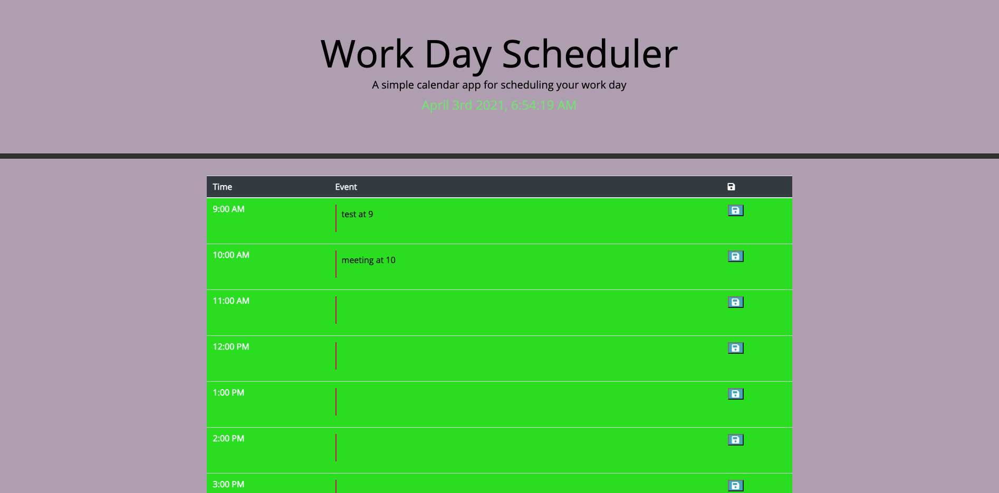

# homework_week_5
 

## Objective
The purpose of this project was to work with using APIs and localStorage.
 
 

## Requirements
* The current date is displayed at the top of the page
* Each timeblock is color coded to show if the event is in the past present or future
* You are able to click on the textarea and enter an event
* When the save button is clicked it saves the text to localStorage
* When the page is reloaded the text feilds stay populated
 
 

## Screenshot

 
 

## Link
[page](https://kevinhenleycode.github.io/homework_week_5/)